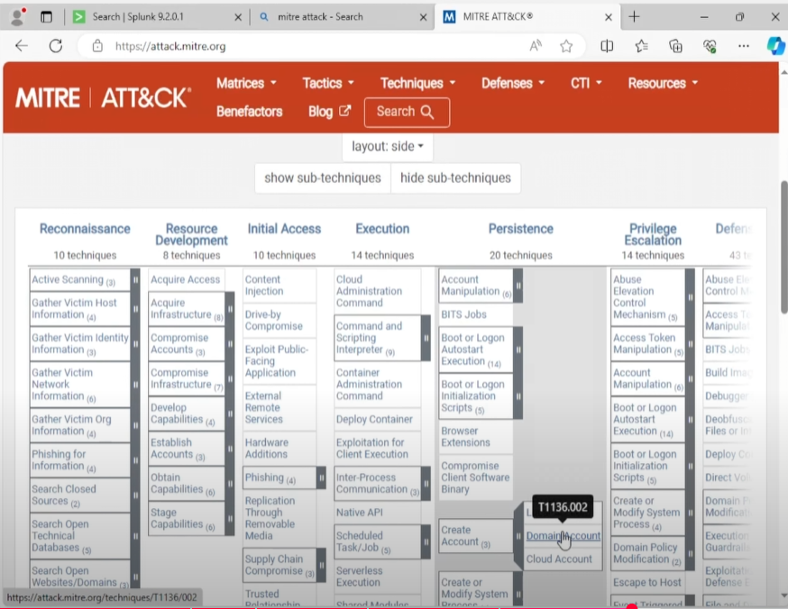

# Crowbar Brute Force Attack Simulation

**Attack Type**: Brute Force Attack using Crowbar

This simulation demonstrates a password brute-force attack on an RDP service using Crowbar from Kali Linux, targeting a domain-joined Windows machine. The goal is to validate whether the brute-force attempt is logged and whether detection is possible via Splunk.

---

## 🎯 Objective

* Simulate brute-force login attempts using Crowbar
* Determine visibility of failed logins in Event Viewer and Splunk
* Assess logging of valid vs. invalid authentication attempts

---

## 🧪 Tools Used

* Kali Linux
* Crowbar tool
* Windows 10 Domain-Joined VM (Target)
* Splunk Universal Forwarder
* Splunk Enterprise with Windows Event Log ingestion

---

## 📊 Attack Command

```bash
crowbar -b rdp -s 192.168.10.100 -u jsmith -C /home/kali/Desktop/passwords.txt
```

Where:

* `-b rdp` specifies brute force module as RDP
* `-s` defines target IP
* `-u` provides the username to brute force
* `-C` supplies a list of passwords

---

## 🔍 Detection in Splunk

### Relevant Windows Logs:

* **Event ID 4625**: Failed login attempt
* **Event ID 4624**: Successful login

### Splunk Query:

```splunk
index=endpoint sourcetype="WinEventLog:Security"
| search EventCode=4625 OR EventCode=4624
| table _time, Computer, Account_Name, Logon_Type, EventCode, Failure_Reason
```

### What to Look For:

* Multiple repeated Event ID 4625 for the same username in a short timeframe
* Followed by a successful login (Event ID 4624)
* Brute-force login patterns and failed attempts from Kali's IP address

> 🔎 **Logon Type 10** indicates a remote desktop session attempt.

---

## ✅ Result

* Multiple failed login attempts (Event ID 4625) recorded in Windows Event Viewer
* Splunk ingested and displayed logs correctly
* Event correlation possible to show brute-force behavior from Kali

---

## 📸 Screenshots

### 1. Crowbar tool launched with RDP brute-force settings:




### 2. RDP brute-force in progress:


### 3. Windows logs show Event ID 4625 for failed attempts:


### 4. Splunk detection of brute-force login attempts:


