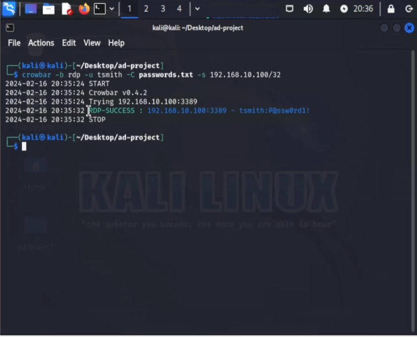

# T1110 – Brute Force (Crowbar RDP)

**MITRE Technique**: [T1110 – Brute Force](https://attack.mitre.org/techniques/T1110/)

This simulation demonstrates an RDP brute-force attack using the Crowbar tool against a domain-joined Windows 10 target. The purpose is to validate detection capabilities in Windows event logs and Splunk.

---

## 🎯 Objective

* Launch a brute-force attack using Crowbar
* Observe failed login attempts (Event ID 4625) in Windows logs
* Confirm detection in Splunk
* Validate successful login with Event ID 4624

---

## 🧪 Attack Method

The Crowbar tool is used with a list of usernames and passwords to perform a brute-force attack over RDP.

```bash
crowbar -b rdp -s 192.168.10.100/32 -u usernames.txt -C passwords.txt -n 3389
```

This command attempts RDP login on the target machine with each credential pair.

---

## 🔍 Detection in Splunk

### Tools Involved:

* Crowbar running on Kali Linux
* Target machine running Windows 10 with RDP enabled
* Sysmon and Windows Event Logging enabled
* Splunk indexing security logs from the Windows host

### Detection Method:

* Windows logs failed login attempts as Event ID **4625**
* Windows logs successful login as Event ID **4624**
* Splunk queries identify excessive 4625 events from a single source and successful 4624 login

### Splunk Detection Query:

```splunk
index=endpoint EventCode=4625
| stats count by Account_Name, host, IpAddress
| where count > 5
```

### What to Look For:

* Numerous Event ID 4625 logs (failed attempts)
* Single Event ID 4624 log (success)
* Same source IP for all attempts (e.g., `Workstation Name: kali`)
* Username reused with many passwords, indicating brute-force pattern

> 🔎 **Correlation with Account Lockouts (4740)**: A high number of 4625 events may lead to account lockout events (ID 4740). This correlation confirms the brute-force impact.

---

## ✅ Result

* 20 failed attempts logged as multiple Event ID 4625 entries (each password attempt)
* 1 successful login logged as Event ID 4624 (when valid credentials were guessed)
* Workstation name `kali` confirms source of the attack
* Splunk dashboard confirms detection and log details

---

## 📸 Screenshots


### 2. RDP brute-force in progress:


### 1. Crowbar tool launched with RDP brute-force settings:


### 5. Splunk code breakdown:


### 3. Windows logs show Event ID 4625 for failed attempts:


### 4. Splunk detection of brute-force login attempts:


### 8. Windows Security Log Event ID 4624 documentation:


### 7. Splunk query result showing Event ID 4624 (success):


### 9. Workstation identification for successful login:


