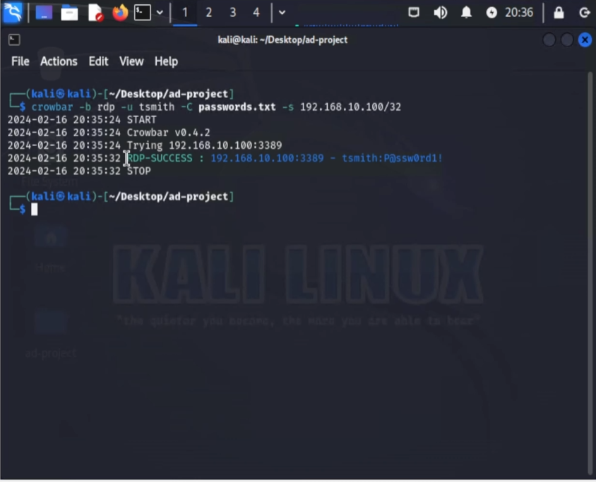

# 🌐 Network Setup

This file documents the network design and virtual networking configuration used to support the Kali + Splunk + ART home lab.

---

## 🧱 Network Architecture

All virtual machines were connected to a VirtualBox **NAT Network** to allow internal communication while isolating from the host. The NAT network simulates a typical internal corporate LAN environment.

### Network Settings:
- **NAT Network Name:** `SplunkNAT`
- **Subnet:** `192.168.10.0/24`
- **DHCP:** Disabled (all machines use static IPs)

📸 Example:  

---

## 🖥️ VM IP Assignments

| Machine               | Hostname     | IP Address       | Role                              |
|-----------------------|--------------|------------------|-----------------------------------|
| Windows Server 2019   | `AD01`       | `192.168.10.7`   | Domain Controller, DNS            |
| Windows 10            | `Target01`   | `192.168.10.100`   | Target (Sysmon + Atomic Red Team) |
| Splunk Server (Linux) | `Splunk01`   | `192.168.10.10`  | Splunk Indexer                    |
| Kali Linux            | `Kali`       | `192.168.10.9`   | Attacker (Crowbar brute force)    |

📸 Examples:  
  

---

## 🔁 Steps to Create the NAT Network

1. Open VirtualBox > Preferences > Network > NAT Networks.
2. Create a new NAT network named `SplunkNAT`.
3. Set the subnet to `192.168.10.0/24`.
4. Disable DHCP.
5. Attach all VMs to this NAT network via **Settings > Network > Adapter 1**.

📸 Example:  

---

## ✅ Target Machine DNS Setup

All machines were configured to use the Domain Controller (`192.168.10.7`) as their primary DNS server to ensure domain joining, hostname resolution, and log forwarding.

📸 Example:  

---

## 🔓 Crowbar Brute Force (Kali)

Kali Linux was configured with **Crowbar** to simulate RDP brute-force attacks on the Windows 10 target. This is in addition to the Atomic Red Team simulations. The purpose is to demonstrate both **password spraying/credential attacks** and **post-exploitation detections**.

📸 Example:  

> This complements MITRE-based simulations by testing real-world credential abuse. Ensure RDP is enabled and user accounts (`tsmith`, `jsmith`, etc.) are valid in AD.

---

## 🧠 Why It Matters

This network setup mirrors a basic corporate LAN where:
- The attacker (Kali) lives inside the network.
- Windows clients are joined to a centralized domain.
- Log data is sent to an internal SIEM (Splunk).
- **Credential-based attacks (Crowbar)** and **post-exploitation simulations (Atomic Red Team)** can be executed and monitored.

Screenshots support every major step to ensure replicability and demonstrate understanding of professional network lab design.
