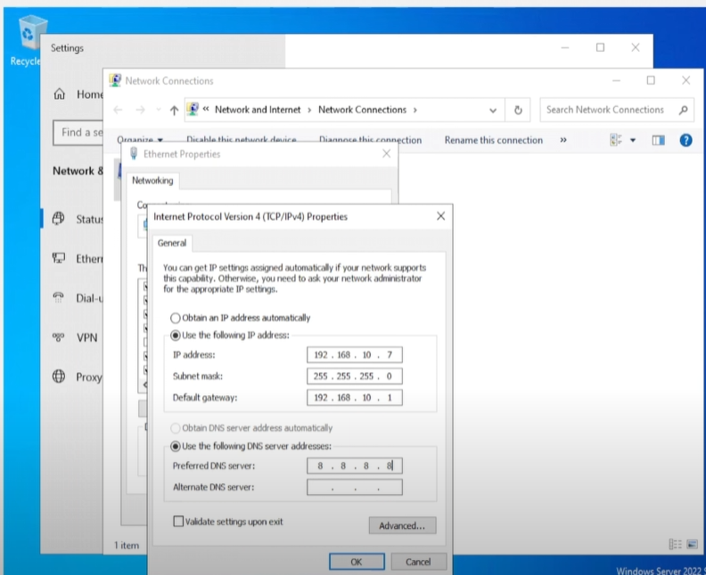

# 🌐 Static IP Configuration

This guide explains how static IP addresses were manually assigned to each virtual machine in the Kali + Splunk + ART home lab. Static IPs are critical for consistent log forwarding, domain resolution, and communication between hosts.

---

## 🧭 IP Address Plan

| Machine               | Hostname     | Static IP       | Notes                                  |
|-----------------------|--------------|------------------|-----------------------------------------|
| Windows Server 2019   | AD01         | 192.168.10.7     | Domain Controller, DNS Server           |
| Windows 10 Target     | Target01     | 192.168.10.100     | Runs Atomic Red Team + Sysmon           |
| Kali Linux            | Kali         | 192.168.10.9     | Runs Crowbar brute-force attacks        |
| Splunk Server         | Splunk01     | 192.168.10.10    | Receives logs from all Windows systems  |

All systems use the same:
- **Subnet mask**: `255.255.255.0`
- **Default gateway**: `192.168.10.1`
- **DNS server**: `192.168.10.7` (Active Directory / Domain Controller)

---

## 🪟 Windows (Static IP Setup)

1. Go to **Control Panel > Network and Sharing Center > Change adapter settings**
2. Right-click **Ethernet > Properties**
3. Select `Internet Protocol Version 4 (TCP/IPv4)` > **Properties**
4. Choose **Use the following IP address**
5. Enter IP, subnet mask, gateway, and DNS
6. Click OK, then reboot if prompted

📸 Example:  


---

## 🐧 Linux (Splunk + Kali)

Edit the network config file:

```bash
sudo nano /etc/netplan/01-netcfg.yaml
