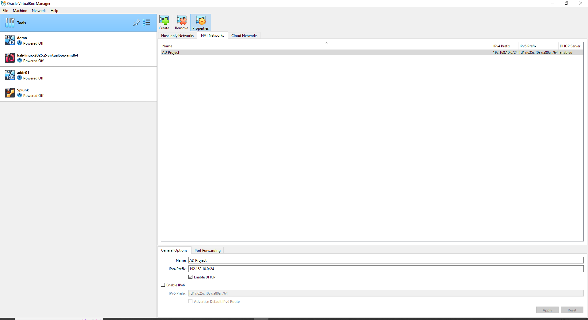
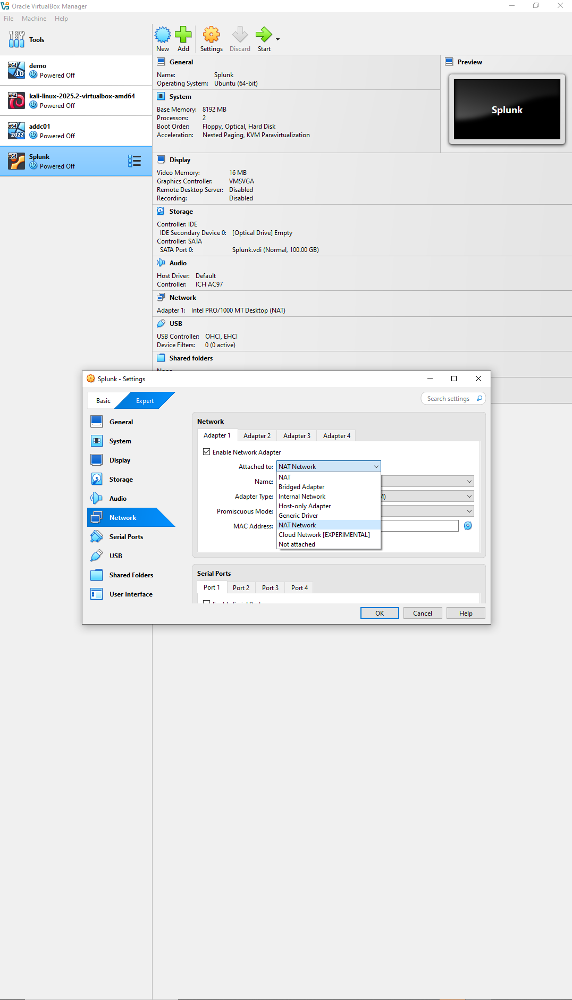

# 💻 Virtual Machine Configuration

This document lists the full specifications for each virtual machine used in the Kali + Splunk + Atomic Red Team + Crowbar home lab.

---

## 🖥️ VM Overview

All virtual machines were created using Oracle VirtualBox and attached to the same NAT network (`SplunkNAT`) for internal communication and simulation of a corporate LAN.

| VM Name   | Operating System         | Role                              | RAM      | CPUs | Storage | Hostname   |
|-----------|--------------------------|-----------------------------------|----------|------|---------|------------|
| AD01      | Windows Server 2019      | Domain Controller + DNS           | 4096 MB  | 2    | 60 GB   | AD01       |
| Target01  | Windows 10 Pro           | Target machine (Sysmon + ART)     | 4096 MB  | 2    | 60 GB   | Target01   |
| Splunk01  | Ubuntu 20.04 LTS         | Splunk log indexer                | 4096 MB  | 2    | 50 GB   | Splunk01   |
| Kali      | Kali Linux Rolling       | Attacker (Crowbar brute force)    | 4096 MB  | 2    | 40 GB   | Kali       |

---

## ⚙️ Common Settings

- All VMs use **VDI dynamically allocated storage**
- All VMs are attached to the NAT Network: `SplunkNAT`
- Guest Additions installed (optional but helpful for clipboard and resolution)
- Host-only adapters are optional and not used in this setup

---

## 📸 Example Screenshots

VM configuration views in VirtualBox:

---

## 🧠 Why This Matters

Maintaining consistent VM specs across the lab ensures reliable simulation performance, log ingestion, and detection across all machines. It also ensures that:
- Splunk has enough resources to ingest and index logs
- ART and Sysmon can run without performance issues
- Crowbar brute-force attacks run in real-time without lag

Use these configurations to replicate the environment or adapt it to your machine’s performance limits.
